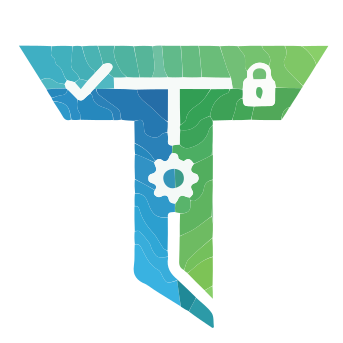

<h1 align="center" id='top'>
   
  
   
  TaskForge v1.0.0
   
</h1>

<h4 align="center">Unified Tools, Seamless Work</h4>

## Table of contents

<ul>
  <li>
    <a href="#about">About</a>
  </li>
  <li>
    <a href="#key-features">Key Features</a>
  </li>
  <li>
    <a href="#how-to-use">How to use</a>
  </li>
  <li>
    <a href="#documentation">Documentation</a>
  </li>
  <li>
    <a href="#feedback">Feedback</a>
  </li>
  <li>
    <a href="#license">License</a>
  </li>
  <li>
    <a href="#contacts">Contacts</a>
  </li>
</ul>

## About 
We are a team of 4 students who were faced with the problem of fragmentation of productivity tools ourselves. Tired of constantly switching between different apps to manage tasks, time, passwords, and budget, we decided to create a solution that was sorely lacking in the market.
Our mission is to create a single and intuitive tool that brings together all aspects of productivity management in one desktop application. We believe that freelancers, solopreneurs, and small teams deserve a tool that saves time and effort, without adding complexity.

***Why TaskForge?***

While working, we experienced the pain of:

- Time wasted switching between different platforms
- Forgotten passwords and chaotic subscription management
- Difficulty tracking time spent and converting it into payment
- Lack of a single place to store client contacts along with projects

***TaskForge*** is the result of our personal experience and understanding of what modern users, developers, and students really need.

## Key Features

- **All-in-One Solution:** Unify task management, time tracking, budget, subscriptions, passwords, and contacts — unlike fragmented tools 
- **User-Friendly UI:** Ready-made functionality "out of the box": one-click task creation, Kanban boards with color labels, automatic sorting by priority - no need for customization
- **Effective financial and expense management:** Budget tracker: one-click expense categorization, integration with time tracker to convert time into pay
- **Subscription tracker:** One-click add-ons (Netflix, Adobe, Zoom), payment reminders, recurring cost schedules, and optimization suggestions ("Not used for 3 months - cancel?") - saves hundreds of dollars every year.
- **Increasing productivity through time management:** timer launch from a task (start/stop/pause, auto-tracking of activity), detailed reports with graphs by clients/projects/categories — identifies "lost" hours and increases efficiency by 30%.

  
## How to use

## Documentation
  

## Feedback
  

## License
MIT
  

## Contacts
  
For more details about our product or any general information regarding TaskForge, feel free to reach out to us.

We are here to provide support and answers any questions you may have. Below are the way to contact our team:

**Email**: Send us your inquiries or support request at taskforge@gmail.com

Subscribe to our`s **LinkedIn** profiles:
- <a href="https://www.linkedin.com/in/kseniia-mekheda-a83032382/"> Kseniia Mekheda</a>
- <a href="https://www.linkedin.com/in/markiyan-bevz-7a2677285/"> Markiyan Bevz</a>
- <a href="https://www.linkedin.com/in/віталій-доманов-2a1460357/"> Vitalii Domanov</a>
- <a href="https://www.linkedin.com/in/ihor-prots-936ba535a/"> Ihor Prots</a>

We look forward to assisting you and ensuring your experience with our products is successful and enjoyable!

<a href="#top">Back to top</a>

